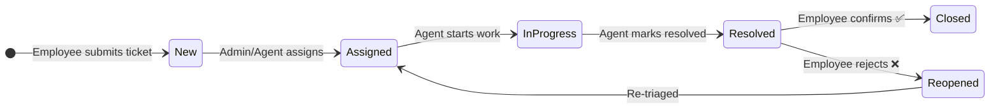

<div align="center">


<br/>

[](https://www.djangoproject.com/)
[](https://www.python.org/)
[](https://www.docker.com/)
[](https://kubernetes.io/)
[](https://www.terraform.io/)
[](./LICENSE)

<br/>

[](https://hub.docker.com/r/jadhavadarsh27/helpdeskx)
[](https://github.com/jadhavadarsh27/helpdeskx)
[](https://github.com/jadhavadarsh27/helpdeskx/commits)

<br/>

> **A cloud-native IT service desk built with Django.**
> Employees raise tickets · Agents resolve them · Admins control everything — all from one dashboard.

<br/>

[🚀 Quick Start](#-quick-start-pick-one) &nbsp;·&nbsp; [✨ Features](#-features) &nbsp;·&nbsp; [🔑 Demo Logins](#-demo-logins) &nbsp;·&nbsp; [🗺 Roadmap](#-roadmap) &nbsp;·&nbsp; [🛠 Troubleshooting](#-troubleshooting)

</div>

---

## 📑 Table of Contents

<details>
<summary>Click to expand</summary>

- [👥 Who Is This For?](#-who-is-this-for)
- [✨ Features](#-features)
- [🎫 Ticket Lifecycle](#-ticket-lifecycle)
- [🧩 Tech Stack](#-tech-stack)
- [🚀 Quick Start (pick one)](#-quick-start-pick-one)
  - [Option A — Local (venv)](#option-a--local-venv)
  - [Option B — Docker Compose](#option-b--docker-compose)
  - [Option C — Kubernetes](#option-c--kubernetes)
  - [Option D — Vercel (serverless)](#option-d--vercel-serverless)
- [🔑 Demo Logins](#-demo-logins)
- [📁 Project Layout](#-project-layout)
- [🏗 Architecture Overview](#-architecture-overview)
- [🛠 Troubleshooting](#-troubleshooting)
- [✅ Deployment Checklist](#-deployment-checklist)
- [🗺 Roadmap](#-roadmap)
- [📄 License](#-license)

</details>

---

## 👥 Who Is This For?

| 🧑‍💼 Role | 🎯 What They Do |
|:---|:---|
| **Employee** | Raises tickets, tracks progress, rates resolutions |
| **Support Agent** | Triages, comments, resolves tickets with SLA awareness |
| **Admin** | Manages categories, SLA policies, users, and views analytics |

---

## ✨ Features

<details>
<summary>🔐 <strong>Auth &amp; Roles</strong> — Custom user model with three distinct roles</summary>

<br/>

Custom `User` model with `Employee`, `Support Agent`, and `Admin` roles.

- ✅ Self-service sign-up
- ✅ Django admin panel for provisioning
- ✅ Role-based view and permission scoping

</details>

<details>
<summary>🎫 <strong>Ticket Lifecycle</strong> — End-to-end state machine for every request</summary>

<br/>

```
New ──► Assigned ──► In Progress ──► Resolved ──► Closed
                                         │
                                         └──► Reopened (if employee rejects resolution)
```

Employees confirm a resolution to **close**, or reject it to **reopen**.

</details>

<details>
<summary>⏱ <strong>SLA Management</strong> — Never miss a deadline</summary>

<br/>

- Per-priority response/resolution windows via `SLAPolicy`
- Automatic due-date stamp on every new ticket
- **Overdue flag** surfaced in the UI for instant visibility

</details>

<details>
<summary>💬 <strong>Comments &amp; Audit Trail</strong> — Full transparency, complete history</summary>

<br/>

- Agents post **internal notes** hidden from the employee
- Full ticket-history log records every status and assignment change
- Nothing is ever deleted — everything is traceable

</details>

<details>
<summary>📎 <strong>Attachments</strong> — Share files right on the ticket</summary>

<br/>

File uploads supported on ticket creation. For production, plug in `django-storages` + S3/R2 to persist files across deploys.

</details>

<details>
<summary>🔔 <strong>Notifications</strong> — Pluggable event-driven alerts</summary>

<br/>

In-app notifications fire on:
- Ticket creation
- Assignment changes
- Status updates
- New comments

See [`notifications/services.py`](./notifications/services.py) — swap in **email** or **WebSocket** delivery later without touching call sites.

</details>

<details>
<summary>📚 <strong>Knowledge Base</strong> — Deflect repeat tickets with self-service</summary>

<br/>

Searchable articles ("Wi-Fi not working", "Password reset") reduce ticket volume and empower employees to help themselves.

</details>

<details>
<summary>📊 <strong>Dashboard &amp; Analytics</strong> — Real-time operational insight</summary>

<br/>

| Metric | Available? |
|:---|:---:|
| Total / Open / Pending / Resolved / Closed counts | ✅ |
| High-priority &amp; Overdue counts | ✅ |
| Average resolution time | ✅ |
| Tickets by category / status / department | ✅ |
| Agent performance (admin-only view) | ✅ |

</details>

<details>
<summary>⭐ <strong>Feedback</strong> — Close the loop with employees</summary>

<br/>

Employees rate resolved tickets **1–5 stars** when accepting them. Aggregate scores surface in agent performance reports.

</details>

---

## 🎫 Ticket Lifecycle



---

## 🧩 Tech Stack

<div align="center">

| Layer | Technology | Purpose |
|:---:|:---:|:---|
| 🐍 **Backend** | Django 6.x | Core framework — apps, ORM, auth, admin |
| 🐘 **Database** | PostgreSQL | Primary data store (SQLite for local dev) |
| ⚡ **Cache/Queue** | Redis | Session caching, future Celery workers |
| 🐳 **Container** | Docker + Compose | `Dockerfile` + multi-service `docker-compose.yml` |
| ☸️ **Orchestration** | Kubernetes | Deployment, HPA, Ingress, NetworkPolicy |
| 🏗 **IaC** | Terraform | VPC, EKS cluster, managed Postgres on AWS |
| 🌐 **Networking** | Ingress + TLS | HTTPS termination, pod-egress NetworkPolicy |

</div>

---

## 🚀 Quick Start (pick one)

> 💡 **New here?** Pick the path that matches your setup. Docker Compose is the fastest way to get everything running.

### Option A — Local (venv)

<details>
<summary>🐍 Click to expand steps</summary>

<br/>

**Prerequisites:** Python 3.12+

```bash
# 1. Create and activate a virtual environment
python -m venv venv && source venv/bin/activate   # Windows: venv\Scripts\activate

# 2. Install dependencies
pip install -r requirements.txt

# 3. Set up the database
python manage.py migrate

# 4. (Optional) Seed demo users, tickets & KB articles
python manage.py seed_demo

# 5. Start the server
python manage.py runserver
```

🌐 Visit **[http://localhost:8000/](http://localhost:8000/)** — you'll land on the dashboard once logged in.

</details>

---

### Option B — Docker Compose

<details>
<summary>🐳 Click to expand steps</summary>

<br/>

**Prerequisites:** Docker Desktop

```bash
# Start the app + Postgres + Redis
docker compose up --build
```

First-time setup (run in a second terminal):

```bash
docker compose exec web python manage.py migrate
docker compose exec web python manage.py createsuperuser
docker compose exec web python manage.py seed_demo   # optional
```

🌐 Visit **[http://localhost:8000/](http://localhost:8000/)**

</details>

---

### Option C — Kubernetes

<details>
<summary>☸️ Click to expand steps</summary>

<br/>

**Prerequisites:** `kubectl`, a running cluster (or use `minikube`/`kind` locally)

```bash
# Step 1 — Build and push your image to Docker Hub
docker build -t jadhavadarsh27/helpdeskx:latest .
docker push jadhavadarsh27/helpdeskx:latest

# Step 2 — Apply all manifests (Deployment, Service, HPA, Ingress, etc.)
kubectl apply -f k8s/

# Step 3 — (Optional) Provision the cluster infrastructure with Terraform
cd terraform
terraform init
terraform apply
```

> ℹ️ Edit `k8s/deployment.yaml` to point to your image tag before applying.

</details>

---

### Option D — Vercel (serverless)

<details>
<summary>⚡ Click to expand steps — ⚠️ requires external Postgres</summary>

<br/>

> ⚠️ **Important:** Vercel's filesystem is read-only. SQLite will throw `OperationalError: unable to open database file` on every write. **You must use a managed Postgres.**

```bash
# Step 1 — Create a free Postgres DB
#   → Neon: https://neon.tech   or   Supabase: https://supabase.com

# Step 2 — Add to requirements.txt
#   dj-database-url
#   psycopg2-binary

# Step 3 — Update settings.py
#   import dj_database_url, os
#   DATABASES = {'default': dj_database_url.config(default=os.environ['DATABASE_URL'])}

# Step 4 — Set DATABASE_URL in Vercel dashboard, then pull & migrate
vercel env pull .env.local
python manage.py migrate
python manage.py seed_demo   # optional

# Step 5 — Harden before going live
#   Set DJANGO_DEBUG=False as a Vercel env var
#   Set ALLOWED_HOSTS to your Vercel domain
```

</details>

---

## 🔑 Demo Logins

> ⚠️ Only available after running `python manage.py seed_demo`.

<div align="center">

| Role | Username | Password | Access Level |
|:---:|:---:|:---:|:---:|
| 👑 Admin | `admin` | `admin12345` | Full system access |
| 🛠 Support Agent | `agent.rios` | `agent12345` | Ticket management |
| 🛠 Support Agent | `agent.chen` | `agent12345` | Ticket management |
| 👤 Employee | `j.doe` | `employee12345` | Submit & track tickets |
| 👤 Employee | `s.patel` | `employee12345` | Submit & track tickets |

</div>

---

## 📁 Project Layout

```
helpdeskx/
│
├── 🔐 accounts/           # Custom User model, auth, profile
├── 🎫 tickets/            # Category, SLAPolicy, Ticket, comments, attachments, history, feedback
├── 📚 knowledgebase/      # Searchable KB articles
├── 📊 dashboard/          # Stats & reporting views
├── 🔔 notifications/      # In-app notification model + pluggable service layer
│
├── 🖼  templates/          # Server-rendered HTML (Bootstrap + custom design system)
├── 🎨 static/css/style.css
│
├── ☸️  k8s/                # Kubernetes manifests (Deployment, HPA, Ingress, NetworkPolicy)
├── 🏗  terraform/          # Infrastructure-as-Code (VPC, EKS, managed Postgres)
│
├── 🐳 Dockerfile
└── 🐳 docker-compose.yml
```

---

## 🏗 Architecture Overview

```
                     ┌─────────────────────────────────────┐
                     │         Internet / Browser            │
                     └─────────────────┬───────────────────┘
                                       │ HTTPS
                     ┌─────────────────▼───────────────────┐
                     │       Ingress Controller (TLS)        │
                     └─────────────────┬───────────────────┘
                                       │
                     ┌─────────────────▼───────────────────┐
                     │    Django App (ClusterIP Service)     │
                     │   Pods auto-scaled by HPA (k8s)       │
                     └──────────┬─────────────────┬─────────┘
                                │                 │
            ┌───────────────────▼──┐   ┌──────────▼─────────┐
            │   PostgreSQL DB       │   │   Redis Cache        │
            │  (managed / RDS)      │   │  (sessions / queue)  │
            └──────────────────────┘   └────────────────────-┘
```

<details>
<summary>🔒 NetworkPolicy: what can talk to what?</summary>

<br/>

| Source | Destination | Allowed? |
|:---:|:---:|:---:|
| Ingress → Django pods | Port 8000 | ✅ |
| Django pods → Postgres | Port 5432 | ✅ |
| Django pods → Redis | Port 6379 | ✅ |
| Django pods → Internet | Any | ❌ (egress locked) |
| Pod → Pod (other namespaces) | Any | ❌ |

</details>

---

## 🛠 Troubleshooting

<details>
<summary>🔴 <code>OperationalError: unable to open database file</code></summary>

<br/>

**Cause:** Running on a read-only filesystem (Vercel, most serverless hosts) while still pointing at SQLite.

**Fix:** Switch to an external Postgres — see [Option D above](#option-d--vercel-serverless).

</details>

<details>
<summary>🟡 Django's yellow debug page is showing in production</summary>

<br/>

**Cause:** `DEBUG=True` is set, which leaks source code and environment settings to anyone who triggers an error.

**Fix:**
```bash
# In your hosting environment's env vars:
DJANGO_DEBUG=False
ALLOWED_HOSTS=yourdomain.com
```

</details>

<details>
<summary>🟡 Static files / CSS not loading after deploy</summary>

<br/>

**Cause:** Static files have not been collected, or `STATIC_URL` is misconfigured.

**Fix:**
```bash
python manage.py collectstatic --noinput
```

Verify `STATIC_URL` and `STATICFILES_DIRS` are set correctly in `settings.py`.

</details>

<details>
<summary>🟡 Ticket attachments disappear after redeploy</summary>

<br/>

**Cause:** Ephemeral hosts (Vercel, most serverless platforms) do not persist local file storage between deploys.

**Fix:** Add [`django-storages`](https://django-storages.readthedocs.io/) with an S3-compatible bucket:

```python
# settings.py
DEFAULT_FILE_STORAGE = 'storages.backends.s3boto3.S3Boto3Storage'
AWS_STORAGE_BUCKET_NAME = 'your-bucket-name'
# Works with AWS S3, Cloudflare R2, Backblaze B2, etc.
```

</details>

---

## ✅ Deployment Checklist

> Run through this before pointing real users at your instance.

- [ ] 🐘 Swapped SQLite → Postgres (`DATABASE_URL` env var in `settings.py`)
- [ ] 🔄 `python manage.py migrate` run against the production database
- [ ] 🔒 `DJANGO_DEBUG=False` set in production environment
- [ ] 🌐 `ALLOWED_HOSTS` set to your real domain
- [ ] 📦 Media storage moved off local disk if on ephemeral hosting (S3 / R2)
- [ ] 👤 Superuser created (`python manage.py createsuperuser`)
- [ ] 🧹 Demo / seed data removed or replaced before real users sign up
- [ ] 🔑 `SECRET_KEY` rotated from the dev default and stored as an env var
- [ ] 📋 `collectstatic` run as part of the build step

---

## 🗺 Roadmap

| Priority | Feature | Status |
|:---:|:---|:---:|
| 🔥 High | Wire `notifications/services.py` into email or WebSocket for live push | 🔲 Planned |
| 🔥 High | Add **Celery + Redis** for background SLA-escalation (auto-escalate overdue tickets) | 🔲 Planned |
| 🟡 Med | Add **DRF serializers/viewsets** over existing models for a REST API layer | 🔲 Planned |
| 🟡 Med | Add automated tests for ticket lifecycle state transitions | 🔲 Planned |
| 🟢 Low | OAuth2 / SSO integration (Google Workspace, Okta) | 💡 Idea |
| 🟢 Low | Slack / Teams bot for ticket creation from chat | 💡 Idea |

---

## 🤝 Contributing

Contributions, issues, and feature requests are welcome!

1. **Fork** the repo
2. **Create** your feature branch: `git checkout -b feat/amazing-feature`
3. **Commit** your changes: `git commit -m "feat: add amazing feature"`
4. **Push** to the branch: `git push origin feat/amazing-feature`
5. **Open** a Pull Request

---

## 📄 License

<div align="center">

MIT License — free to use, modify, and deploy for your own projects.

See [`LICENSE`](./LICENSE) for full terms.

<br/>

**Built with ❤️ using Django**

[](https://forthebadge.com)
[](https://forthebadge.com)

</div>
